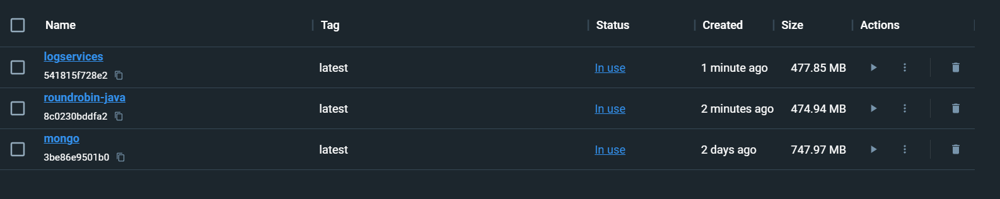
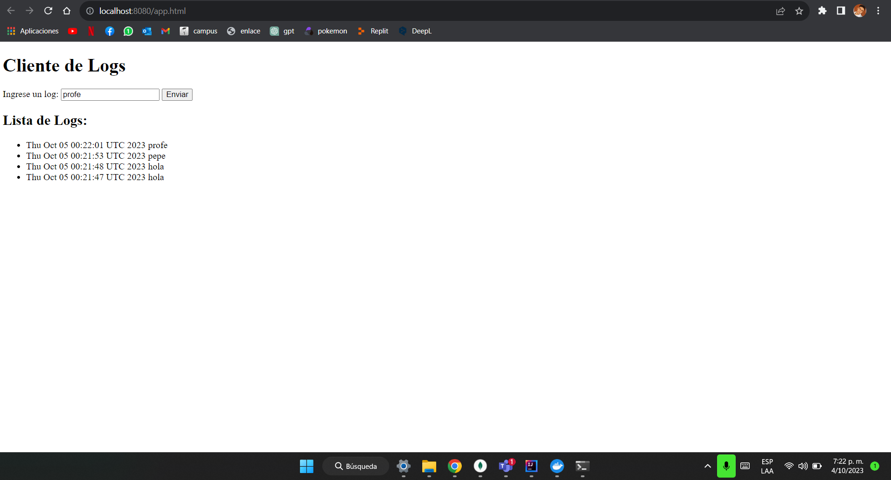

# AREP06 : TALLER DE TRABAJO INDIVIDUAL EN PATRONES ARQUITECTURALES

TALLER DE TRABAJO INDIVIDUAL EN PATRONES ARQUITECTURALES

### Prerequisitos

- Maven
- Git
- Java
- Docker 
- AWS 

### Instalación

Clonamos el repositorio

```
    https://github.com/CamiloCanta/AREP_lab6.git

```

### Corriendo
Corremos el siguiente comando:

```
    mvn clean package install

```

Clonamos el siguiente repositorio(RoundRobin) en el mismo directorio que esta el repositorio actual

[RoundRobin](https://github.com/CamiloCanta/RoundRobin.git)

Y hacemos los mismos pasos

```
    cd AREPRoundBound
    mvn clean package install

```
Una vez tengamos los dos proyectos bien compilados y listos para ejecutar, construimos sus imagenes respectivamente

```
    docker build --tag roundrobin-java .
    cd ..
    cd AREP_lab6
    docker build --tag logservices .
```

Bajamos la imagen de mongo:

```
    docker pull mongo
```
Una vez tenga todo lo anterior hecho, asegurate estar en el directorio raiz de este repositorio y ejecuta el siguiente comando.


```
    docker-compose up -d  
```

deberiamos ver las imagenes en docker:



Ingresamos a: http://localhost:8080/app.html para previsualizar:




### Arquitectura del programa


- El servicio MongoDB es una instancia de MongoDB corriendo en un container de docker en una máquina virtual de EC2.
- LogService es un servicio REST que recibe una cadena, la almacena en la base de datos y responde en un objeto JSON con las 10 ultimas cadenas almacenadas en la base de datos y la fecha en que fueron almacenadas.
- La aplicación web APP-LB-RoundRobin está compuesta por un cliente web y al menos un servicio REST. El cliente web tiene un campo y un botón y cada vez que el usuario envía un mensaje, este se lo envía al servicio REST y actualiza la pantalla con la información que este le regresa en formato JSON. El servicio REST recibe la cadena e implementa un algoritmo de balanceo de cargas de Round Robin, delegando el procesamiento del mensaje y el retorno de la respuesta a cada una de las tres instancias del servicio LogService.

### Despliegue en AWS


### Evidencia

- [video](https://youtu.be/WEG0T3lRH9M)

El video demuestra que esta desplegado en la nube de AWS, ademas a traves de los logs de el contenedor de RoundRobin se puede observar el funcionamiento.


## Construido con

* [Maven](https://maven.apache.org/): Apache Maven es una herramienta que estandariza la configuración del ciclo de vida del proyecto.
* [Git](https://rometools.github.io/rome/):  Es un sistema de control de versiones distribuido (VCS).
* [Intellj](https://www.jetbrains.com/es-es/idea/): IntelliJ IDEA es un IDE que ayuda a los desarrolladores a escribir, depurar y administrar código de manera más eficiente y efectiva, con muchas características que facilitan el proceso de desarrollo de software.
* [Java 17](https://www.java.com/es/): Lenguaje de programación de propósito general con enfoque a el paradigma de orientado a objetos, y con un fuerte tipado de variables.
* [Html](https://developer.mozilla.org/es/docs/Learn/Getting_started_with_the_web/HTML_basics): es un lenguaje de marcado que estructura una página web y su contenido.
* [JavaScript](https://developer.mozilla.org/es/docs/Learn/JavaScript/First_steps/What_is_JavaScript): lenguaje de programación que los desarrolladores utilizan para hacer paginas web dinamicas.
* [CSS](https://developer.mozilla.org/es/docs/Web/CSS) Lenguaje para darles estilos a paginas web.
* [Docker](https://www.docker.com) Automatiza el despliegue de aplicaciones dentro de contenedores de software.
* [AWS](https://aws.amazon.com/es/free/?trk=8fa18207-f2c2-4587-81a1-f2a3648571b3&sc_channel=ps&ef_id=CjwKCAjwseSoBhBXEiwA9iZtxmEwAgfk7jPE4NlzdkF60BOim6V2loEW5eNT7e8yJcbyO0g8dZpJaBoCRIEQAvD_BwE:G:s&s_kwcid=AL!4422!3!647999789205!e!!g!!aws!19685287144!146461596896&gclid=CjwKCAjwseSoBhBXEiwA9iZtxmEwAgfk7jPE4NlzdkF60BOim6V2loEW5eNT7e8yJcbyO0g8dZpJaBoCRIEQAvD_BwE&all-free-tier.sort-by=item.additionalFields.SortRank&all-free-tier.sort-order=asc&awsf.Free%20Tier%20Types=*all&awsf.Free%20Tier%20Categories=*all) colección de servicios de computación en la nube pública que en conjunto forman una plataforma de computación en la nube


## Autor
- [Camilo Cantillo Tatis](https://www.linkedin.com/in/camilocanta/)  - LinkedIn
- [CamiloCanta](https://github.com/CamiloCanta) - GitHub

